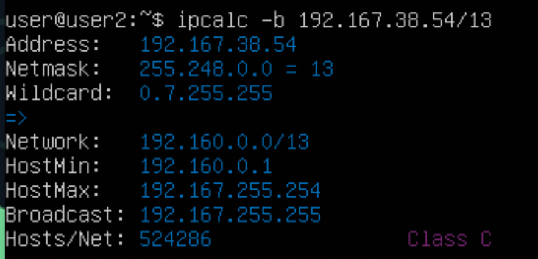

## Part 1. Инструмент ipcalc

Установил **ipcalc**:

 > ` sudo apt install ipcalc `

Поднял виртульную машину ws1:

### 1.1. Сети и маски

### 1) Определил адрес сети `192.167.38.54/13` с помощью команды:

> ` ipcalc 192.167.38.54/13 `



### 2) Пеpевод масок

Перевод маски `255.255.255.0`:

Префиксная запись `/24`. Двоичная запись - `11111111.11111111.11111111.00000000`


Перевод `/15` в обычную и двоичную:

Обычная запись - `255.254.0.0`. Двоичная запись - `11111111.11111110.00000000.00000000`


Перевод `11111111.11111111.11111111.11110000` в обычную и префиксную:

Посчитал количество ненулевых бит в `11111111.11111111.11111111.11110000` и получид - `28`. Использовал команду`ipcalc 192.167.38.54/28`

Обычная запись - `255.255.255.240`. Префиксная запись - `/28`.


### 3) Минимальный и максимальный хост `12.167.38.4`.

При маске `/8`:

Минимальный хост - `12.0.0.1.` Максимальный хост - `12.255.255.254.`


При маске `11111111.11111111.00000000.00000000`: 

Минимальный хост - `12.167.0.1.` Максимальный хост - `12.167.255.254.`


При маске `255.255.254.0`:
 
Минимальный хост - `12.167.38.1`. Максимальный хост - `12.167.39.254`.


При маске `/4`:
 
Минимальный хост - `0.0.0.1`. Максимальный хост - `15.255.255.254`.

### 1.2. localhost

    194.34.23.100/16 - нет доступа
    
    127.0.0.2/24 - есть
    
    127.1.0.1/8 - есть
    
    128.0.0.1/8 - нет доступа

    
### 1.3. Диапазоны и сегменты сетей

1) Какие адреса можно использовать в качестве публичного, а какие только в качесте частных?
    ```
    10.0.0.45/8 - Частный
    
    134.43.0.2/16 - Публичный
    
    192.168.4.2/16 - Частный
    
    172.20.250.4/12 - Частный
    
    172.0.2.1/12 - Публичный
    
    192.172.0.1/12 - Публичный
    
    172.68.0.2/12 - Публичный
    
    172.16.255.255/12 - Частный
        
    10.10.10.10/8 - Частный
    
    192.169.168.1/16  - Публичный
    ```
2) Какие из перечисленных адресов шлюза возможны у сети ?
```
    HostMin 10.10.0.1 

    HostMax 10.10.63.254

    10.10.0.2, 10.10.10.10, 10.10.1.255 - возможны
    10.0.0.1, 10.1 - невозможны
  ```  
## Part 2. Статическая маршрутизация между двумя машинами

Поднял две виртуальные машины `ws1` и `ws2`. В настройках каждой машины во вкладке `сеть` задал тип подключения `внутренняя сеть`. Запустил обе машины и установил им соотвествующие имена хоста при помощи команды:

> ` sudo hostnamectl set-hostname [machine name]`

С помощью команды `ip a` посмотрел существующие сетевые интерфейсы:

`ws1`


`ws1`


Описал сетевой интерфейс, соответствующий внутренней сети, на обеих машинах и задал следующие адреса и маски: 

Использовал команду `sudo nano etc/netplan/00-installer-config.yaml` для открытия файла и установки в нем статического адреса. Этот файл отвечает за настройку интерфейсов сети.

`ws1` - `192.168.100.10`, маска `/16`: 


`ws2` - `172.24.116.8`, маска `/12`


Выполнил команду `netplan apply` для перезапуска сервиса сети
 
### 2.1. Добавление статического маршрута вручную

Соединил машины командами `ip r add [адрес] dev [интерфейс]`, пропинговал:

`ws1`


`ws2`


### 2.2. Добавление статического маршрута с сохранением

Перезапустил машины при помощи команды `sudo reboot`

Добавил статический маршрут от одной машины до другой отредактировав файл `etc/netplan/00-installer-config.yaml`:

`ws1`
 

`ws2`
 

На обоих машинах применил новые настройки использовав команду:
> `sudo netplan apply`

Пропинговал соединение между шинами:

 

 

## Part 3. Утилита iperf3

### 3.1. Скорость соединения

```
8 Mbps   = 1 MB/s
100 MB/s = 819200 Kbps
1 Gbps   = 1024 Mbps
```

### 3.2. Утилита iperf3

Измерил скорость соединения между `ws1` и `ws2`:

`ws1` выступает в роли сервера. Запуск `iperf3` сервер, команда: ziperf3 -sz 

`ws2` выступает в роли клиента. Запуск `iperf3` клиент, команда: `iperf3 -c 192.168.100.10`

`ws1`    
    

`ws2`
    


## Part 4. Сетевой экран

### 4.1. Утилита iptables

Создал файл `/etc/firewall.sh`, имитирующий фаерволл, на `ws1` и `ws2` с помощью команды `sudo touch /etc/firewall.sh`

Добавил в файл следующие правила согласно заданию:

1) на `ws1` применил стратегию когда в начале пишется запрещающее правило, а в конце пишется разрешающее правило 

2) на `ws2` применил стратегию когда в начале пишется разрешающее правило, а в конце пишется запрещающее правило

3) открыл на машинах доступ для порта 22 (ssh) и порта 80 (http).

4) запретил `echo reply` (машина не должна "пинговаться”, т.е. должна быть блокировка на OUTPUT).

5) разрешил `echo reply` (машина должна "пинговаться").

`ws1`


`ws2`


   

Разница между стратегиями, применёнными в первом и втором файлах, заключается в следующем: в утилите `iptables` правила выполняются сверху вниз. На первой машине первым указано запрещающее правило на выход, поэтому она не сможет пропинговать другую машину. У второй машины, наоброт - первым указано разрешающее правило, значит она сможет пропинговать другую машину.

### 4.2. Утилита nmap

Командой `ping` нашел машину, которая не "пингуется": 

   
   

Запустил утилиту `nmap (для проверки ищем в выводе nmap наличие строки Host is up):

   

## Part 5. Статическая маршрутизация сети

Поднял пять виртуальных машин (3 рабочие станции (ws11, ws21, ws22) и 2 роутера (r1, r2))

### 5.1. Настройка адресов машин

Настроил конфигурации машин в `etc/netplan/00-installer-config.yaml` согласно сети на рисунке:

  

  

  

  

  

Перезапустил сервис сети и проверил адрес машины:

  

  

  

  

  

Пропинговал `ws22` с `ws21` и `r1` с `ws11`

  

  

### 5.2. Включение переадресации IP-адресов.

Для включения переадресации IP, выполнил команду на роутерах:

> `sysctl -w net.ipv4.ip_forward=1`

При таком подходе переадресация не будет работать после перезагрузки системы.

 

 

Открыл файл `/etc/sysctl.conf`:
Раскомментировал строку `net.ipv4.ip_forward = 1` и сохранил изменения. Теперь IP-переадресация включена на постоянной основе.

 

 

### 5.3. Установка маршрута по-умолчанию

Настроил маршрут по-умолчанию (шлюз) для рабочих станций. Для этого добавил `default` перед IP роутера в файле конфигураций:
 
 

 

 

Вызвал `ip r` и показал, что добавился маршрут в таблицу маршрутизации:

 

 


Пропинговал с `ws11` роутер `r2` и показал на `r2`, что пинг доходит:


### 5.4. Добавление статических маршрутов

Добавил в роутеры `r1` и `r2` статические маршруты в файле конфигураций:


Вызвал `ip r` и показал таблицы с маршрутами на обоих роутера:


Запустил команды на `ws11`:

>`ip r list 10.10.0.0/18`

>`ip r list 0.0.0.0/0`


Для адреса `10.10.0.0/18` был выбран маршрут, отличный от `0.0.0.0/0` (он попадает под маршрут по-умолчанию), т.к. машина `ws11` соединена с сетью `10.10.0.0/18` по своему IP-адресу `10.10.0.2`, для других адресов используется маршрут по умолчанию, который указан в файле `10.10.0.1`.

### 5.5. Построение списка маршрутизаторов

Запустил на `r1` команду дампа `tcpdump -tnv -i enp0s8`:

При помощи утилиты traceroute построил список маршрутизаторов на пути от  `ws11` до `ws21`:


Каждый пакет проходит на своем пути определенное количество узлов, пока достигнет своей цели. Причем, каждый пакет имеет свое время жизни. Это количество узлов, которые может пройти пакет перед тем, как он будет уничтожен. Этот параметр записывается в заголовке TTL, каждый маршрутизатор, через который будет проходить пакет уменьшает его на единицу. При TTL=0 пакет уничтожается, а отправителю отсылается сообщение Time Exceeded.

Команда traceroute linux использует UDP пакеты. Она отправляет пакет с TTL=1 и смотрит адрес ответившего узла, дальше TTL=2, TTL=3 и так пока не достигнет цели. Каждый раз отправляется по три пакета и для каждого из них измеряется время прохождения. Пакет отправляется на случайный порт, который, скорее всего, не занят. Когда утилита traceroute получает сообщение от целевого узла о том, что порт недоступен трассировка считается завершенной.

### 5.6. Использование протокола ICMP при маршрутизации

Запустил на `r1` перехват сетевого трафика, проходящего через `eth0`:


Пропинговал с `ws11` несуществующий IP:


## Part 6. Динамическая настройка IP с помощью DHCP

 Указал адрес маршрутизатора по-умолчанию, DNS-сервер и адрес внутренней сети
  


В файле `resolv.conf` прописал `nameserver 8.8.8.8`:


Перезагрузил службу DHCP командой `systemctl restart isc-dhcp-server`. Машину `ws21` перезагрузил при помощи `reboot` и через `ip a` показал, что она получила адрес. Также пропинговал `ws22` с `ws21`.


Указал MAC адрес у `ws11`:


Для `r1` настроил аналогично `r2`, но сделать выдачу адресов с жесткой привязкой к MAC-адресу (ws11). Провел аналогичные тесты:


Пропинговал соединение: 


Запросил с `ws21` обновление ip адреса:


В части 6 были использованы следующие опции DHCP протокола:

`option routers ip-address [, ip-address...]`; - адреса шлюзов для клиентской сети. Маршрутизаторы должны быть перечислены в порядке предпочтительности.
`option domain-name-servers ip-address [, ip-address...]`; - Список DNS серверов доступных клиенту. Сервера должны быть перечислены в порядке предпочтительности.

## Part 7. NAT

В файле `/etc/apache2/ports.conf` на `ws22` и `r1` изменил строку `Listen 80` на `Listen 0.0.0.0:80`, то есть сделал сервер Apache2 общедоступным:


Запустил веб-сервер `Apache` командой `service apache2 start` на `ws22` и `r1`:


Добавил в фаервол, созданный по аналогии с фаерволом из Части 4, на `r2` следующие правила:

1)Удаление правил в таблице `filter - iptables -F`

2)Удаление правил в таблице `"NAT" - iptables -F -t nat`

3)Отбрасывать все маршрутизируемые пакеты - `iptables --policy FORWARD DROP`


Проверил соединение между `ws22` и `r1` командой ping:


Добавил в файл ещё одно правило:

4) разрешить маршрутизацию всех пакетов протокола `ICMP`


Добавил в файл ещё два правила:

5)Включить `SNAT`, а именно маскирование всех локальных ip из локальной сети, находящейся за `r2` (по обозначениям из Части 5 - сеть 10.20.0.0)

6)Включить `DNAT` на `8080` порт машины `r2` и добавить к веб-серверу `Apache`, запущенному на `ws22`, доступ извне сети


Проверил соединение по `TCP`для `SNAT`, для этого с` ws22` подключился к серверу `Apache` на `r1`:


Проверил соединение по `TCP` для `DNAT`, для этого с `r1` подключился к серверу `Apache`на `ws22` командой `telnet`:


## Part 8. Дополнительно. Знакомство с SSH Tunnels

Запустил на `r2` фаервол с правилами из Части 7:

Запустил веб-сервер `Apache` на `ws22` только на `localhost` (то есть в файле `/etc/apache2/ports.conf `изменид строку `Listen 80` на `Listen localhost:80`):


Воспользовался `Local TCP forwarding` с `ws21` до `ws22`, чтобы получить доступ к веб-серверу на `ws22` с `ws21`:


Воспользовался `Remote TCP forwarding` c `ws11` до `ws22`, чтобы получить доступ к веб-серверу на `ws22` с `ws11`


Для проверки, сработало ли подключение в обоих предыдущих пунктах, перешел во второй терминал  и выполнил команду:
telnet 127.0.0.1 [локальный порт]


